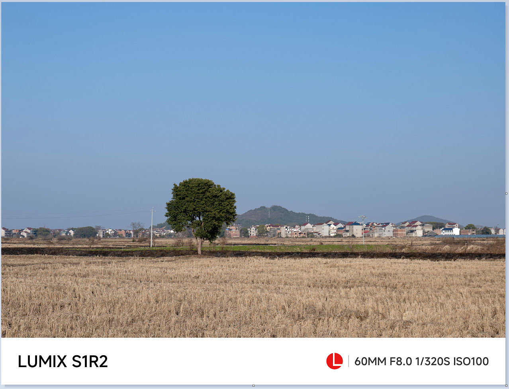

# lumix_mark
一键给指定照片或者文件下所有照片添加exif水印，logo目前为L卡口，作者使用的LUMIX相机；

```
Usage: lumix_mark.exe [OPTIONS] [IMAGES]...

Arguments:
  [IMAGES]...  多张图片地址或者文件夹，使用空格分隔

Options:
  -t, --target-path <TARGET_PATH>  输出到指定文件夹，不存在则会创建 [default: .]
  -q, --quality <QUALITY>          图片质量 （75 - 100） [default: 75]
  -r, --ratio <RATIO>              水印相当于短边的比率（0.1 - 0.15） [default: 0.14]
  -h, --help                       Print help
  -V, --version                    Print version
```
### 通过[release](https://github.com/losenli/lumix_mark/releases)下载

### 使用示例
```shell
lumix_mark.exe .\imgs .\imgs\82592256136.jpg -t .\marked_images -q 90 -r 0.12
```

